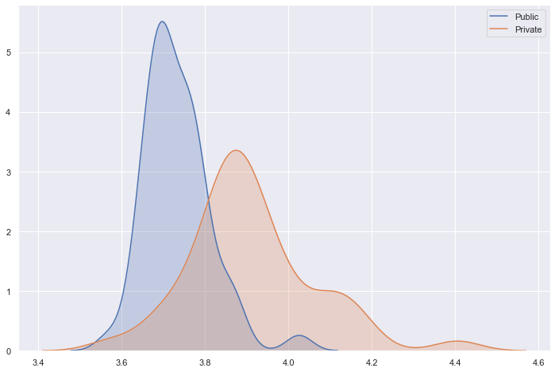

# rate-my-professor

Goal: Analyze differences in professor ratings among different factors from the website, RateMyProfessor.com.

Data:
- Gathered professor ratings from the RateMyProfessor API
  - 50 most populated private and public colleges from each of the 50 states
  - 146 departments from Pennsylvania State University
  - Top 50 professors with the longest names from Pennsylvania State University

Process:
- Performed hypothesis tests including the t-test and ANOVA to determine whether ratings were statistically different
- Organized and sorted data using both pandas and SQL queries
- Created visualizations of distributions and regressions using seaborn and matplotlib

Conclusions:
- The departments within Pennsylvania State University had a statistically significant difference, especially between STEM and liberal arts.
- STEM departments had a wider distribution of ratings centered around a 3 out of 5, while liberal arts was heavily concentrated around a rating of 4.5 out of 5.
- Private and public colleges had a statistically significant difference in ratings.
- Private colleges had a higher standard deviation as well as a higher average rating.

Visualizations:

